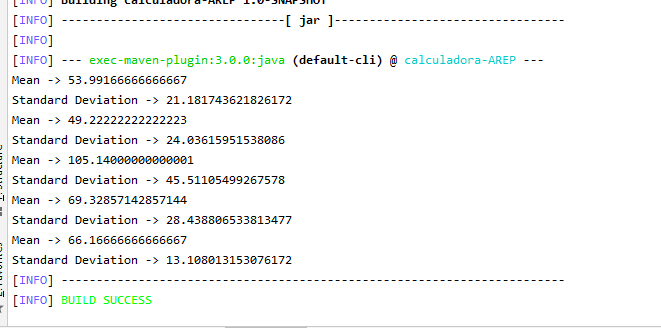

# AREP-calculadoraEstadisticaMediaDesviacion

In this project we made a calculator that helps us to calculate the mean and the standard deviation through the own implementation of Linked lists.
 
## Model

  This is the Model that was used for the project
  
  
  

## Getting Started

  Here's a guide to running the project on a local machine
  
  ### Prerequisites
  
  it is necessary to have previously installed these tools:
  
  * Java 
  * Maven 
  * Git
 

  
   ### Tests
   
   We can run the tests with the following command:
   
     `mnv test`
      
   After running the tests we can appreciate the following result:
     
   
     
   

  ### Setting up
  
1. **First it is necessary to clone this repository:** 

   `Git clone https://github.com/Sim0no/AREP-calculadoraEstadisticaMediaDesviacion`

2. **After this we will compile the project with the following command with maven:**
  
    `mvn package`

3. **Now we need to run the project using a default data set with the following command:**

    `mvn exec:java -Dexec.mainClass="edu.escuelaing.arep.calculadora.App" -Dexec.args="dataTest.txt"`

    
   after running the above command it will show the standard deviation and mean of the default data set:
    
    
     
     
    
  ## Documentation
  
 For more information on this project [here](https://sim0no.github.io/AREP-calculadoraEstadisticaMediaDesviacion/) is a link to the project's JavaDoc.

  ## License
  
  This project is licensed under the GNU General Public License v3.0 - see the [LICENSE](https://github.com/Sim0no/AREP-calculadoraEstadisticaMediaDesviacion/blob/master/LICENSE) file for more details.
  
  
  ## Author
  
  German Simon Marin Mejia ([Sim0no](https://github.com/Sim0no))
  
